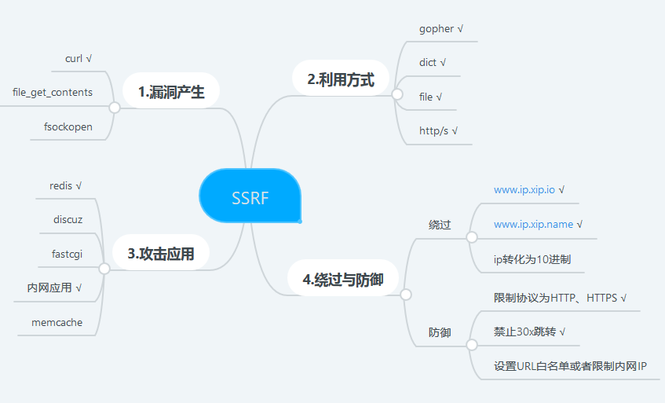
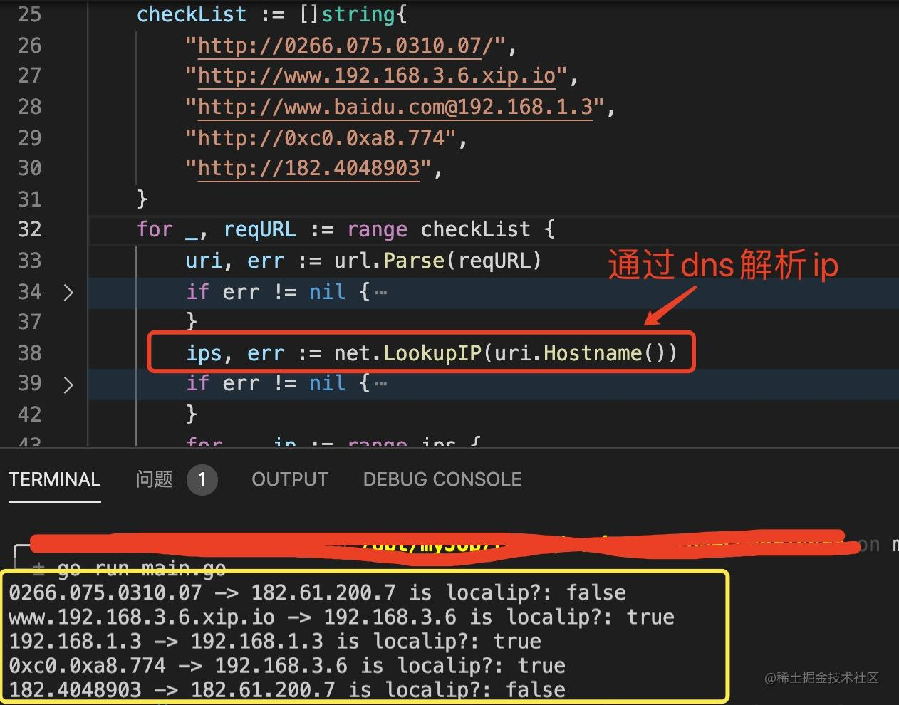
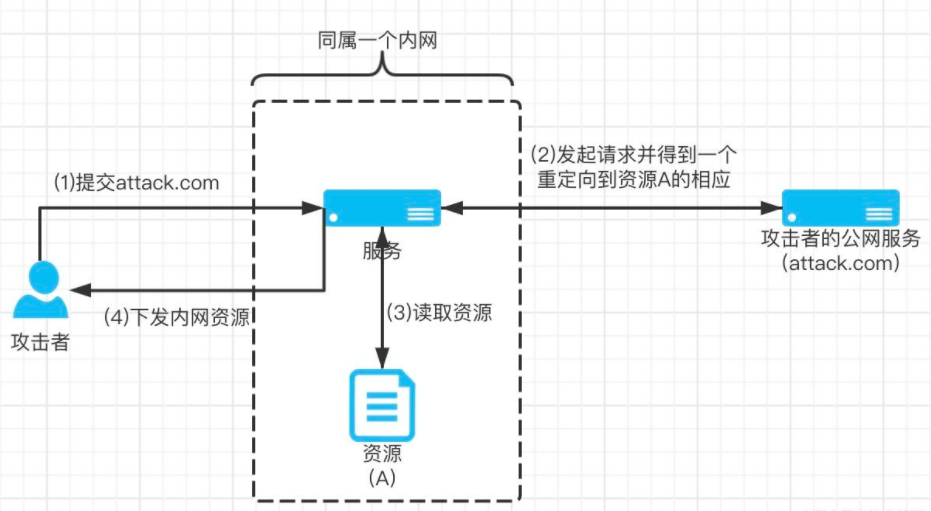
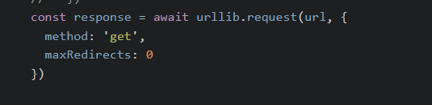
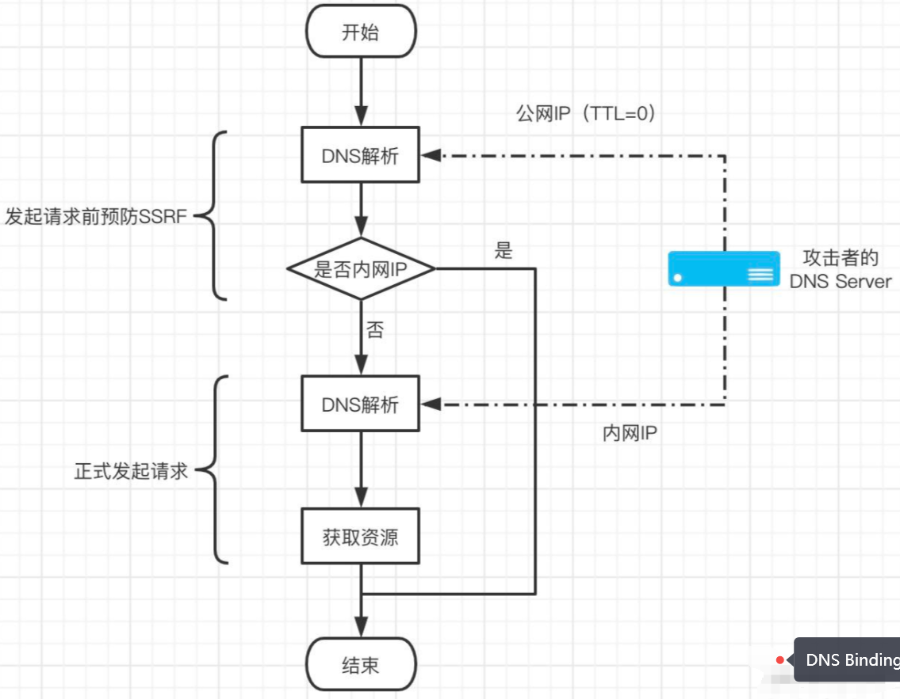
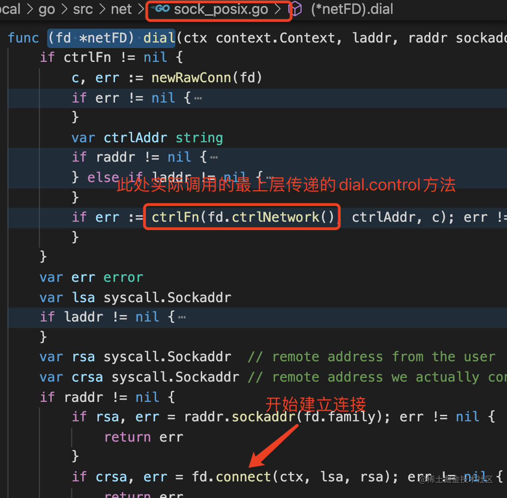

# goweb-ssrf
golang tool for ssrf protection

what is ssrf ?  


# SSRF

> SSRF英文全拼为Server Side Request Forgery，翻译为服务端请求伪造。攻击者在未能取得服务器权限时，利用服务器漏洞以服务器的身份发送一条构造好的请求给服务器所在内网。关于内网资源的访问控制，想必大家心里都有数。

SSRF（Server-Side Request Forgery）是一种网络攻击技术，其目的是让服务器执行攻击者指定的请求。在这种攻击中，攻击者会利用网站的漏洞，欺骗服务器执行指定的请求，从而访问内部网络上的敏感信息或系统功能。

举个例子，如果一个网站允许用户提交 URL，并显示提交的 URL 对应的图片。如果这个网站没有对用户输入进行验证，攻击者就可以提交一个内部网络上的 URL，从而让服务器访问内部网络上的敏感信息。

防范 SSRF 攻击的方法包括对用户输入进行验证，禁止访问内部网络上的地址，以及实施严格的访问控制。


使用的服务中有以下功能：
- 通过URL地址分享内容
- 通过URL地址把原地址的网页内容调优使其适合手机屏幕浏览（转码功能）
- 通过 URL 地址翻译对应文本的内容，即类似 Google 的翻译网页功能
- 通过 URL 地址加载或下载图片，即类似图片抓取功能
- 以及图片、文件抓取收藏功能

如图片抓取功能
```javascript
const response = await axios({
method: 'get',
responseType: 'arraybuffer',
url
})
ctx.body = response.data;
ctx.set(response.headers);
```

但是，如果调用时，传入了一个内网地址。就可以从外网，非法访问内网。如果应用程序对用户提供的URL和远端服务器返回的信息没有进行合适的验证和过滤，就会存在这种服务端请求伪造的缺陷，即 Server-Side Request Forgery，简称 SSRF。

# 危害

SSRF攻击通常会导致组织内未经授权的操作或对数据的访问，
在某些情况下，SSRF漏洞可能允许攻击者执行任意命令执行。

攻击者可以利用 SSRF 实现的攻击主要有 5 种：

- 可以对外网、服务器所在内网、本地进行端口扫描，获取一些服务的 Banner 信息
- 攻击运行在内网或本地的应用程序（比如溢出）
- 对内网 Web 应用进行指纹识别，通过访问默认文件实现
- 攻击内外网的 Web 应用，主要是使用 GET 参数就可以实现的攻击
- 利用 file 协议读取服务器文件

最后一条的防御，需要对协议做判断。

**常见的场景函数**

```golang
http.Get(url)
http.Post(url, contentType, body)
http.Head(url)
http.PostForm(url, data)
http.NewRequest(method, url, body)
```

# 防护思路

防止SSRF漏洞：

- 对外部输入进行过滤和验证，以确保它们是有效的。
- 使用安全的库和框架，这些库和框架可以帮助您防止SSRF漏洞。
- 避免将用户提供的数据用于构造URL。
- 限制可以访问的网络范围。
# 解决方案
- 要堵住这个漏洞，关键在于验证用户输入的网址，特别是网址解析后的IP地址。
- 解决方案：解析用户提交的网址得到IP，对于短链接或http://xip.io等代理服务生成的IP必须跟踪解析，然后屏蔽内网IP段。
  - 解析目标 URL, 获取 scheme、host（推荐使用系统内置函数完成,避免自己使用正则提取）
  - 检查 scheme 是否为合法 (如非特殊需求请只允许 http 和 https)
  - 解析 host 获取 dns 解析后的 IP 地址
  - 检查解析后的 IP 地址是否为外网地址，过滤掉内网地址
  - 请求经过解析后的 IP 地址

**关于内网地址的判断，请不要忽略IPv6的回环地址和IPv6的唯一本地地址**

使用解析后的 IP 地址替换 host 请求、禁用 Redirect 跟踪：
    
如果最后一步直接传入URL直接请求,会导致再次进行DNS解析,通过 [DNS Rebinding](https://zh.wikipedia.org/wiki/DNS%E9%87%8D%E6%96%B0%E7%BB%91%E5%AE%9A%E6%94%BB%E5%87%BB) 有概率绕过 IP 地址检查从而访问内网 IP 地址.请求需要禁用 Redirect 跟踪, 如有需要跟踪 Redirect 的需求, 需再次判断 scheme、host 解析、IP 地址。保证真正请求的是经过过滤的ip地址，即可。

# 代码示例

首先要禁用掉非http(s)协议，如果判断出请求来源协议不为http(s)，则中断请求。

### 关键点1 ： 内网地址判断

其次要禁用内网地址。如10，192，127开头的ip地址。这里过滤地址不要直接通过正则匹配请求地址，要通过dns查询来源域名；将所有的域名最终转换为ip，就是不管参数是ip还是域名，最终都要判断即将请求的ip地址，并过滤内网ip。同时，对dns查询错误做出处理。将所有的链接都转为ip处理。这样做的好处有，可以有效防御短连接绕过；DNS重绑绕过。


具体ip地址过滤代码如下：

```javascript
function ipIsPrivate(addr) {
  return /^(::f{4}:)?10\.([0-9]{1,3})\.([0-9]{1,3})\.([0-9]{1,3})$/i
 .test(addr) ||
  /^(::f{4}:)?192\.168\.([0-9]{1,3})\.([0-9]{1,3})$/i.test(addr) ||
  /^(::f{4}:)?172\.(1[6-9]|2\d|30|31)\.([0-9]{1,3})\.([0-9]{1,3})$/i
 .test(addr) ||
  /^(::f{4}:)?127\.([0-9]{1,3})\.([0-9]{1,3})\.([0-9]{1,3})$/i.test(addr) ||
  /^(::f{4}:)?169\.254\.([0-9]{1,3})\.([0-9]{1,3})$/i.test(addr) ||
  /^f[cd][0-9a-f]{2}:/i.test(addr) ||
  /^fe80:/i.test(addr) ||
  /^::1$/.test(addr) ||
  /^::$/.test(addr);
}
```

```javascript
const protocolAndDomainRE = /https?:/i

const localhostDomainRE = /^localhost[\:?\d]*(?:[^\:?\d]\S*)?$/
const nonLocalhostDomainRE = /^[^\s\.]+\.\S{2,}$/

```


dns查询错误处理  如果查询错误的ip，统一认为处理为内网地址：


```javascript
const axios = require('axios');
const dns = require('dns')
const { parse } = require('url')
function getHostByName (domain) {
  return new Promise((resolve, reject) => {
      dns.lookup(domain, (err, address, family) => {
          if(err) {
              reject(err)
          }
          resolve(address)
      })
  })
}

const ssrfSolution = async function () {
  // 判断内网ip
 let host
  try {
    host = await getHostByName(hostname)
  } catch (err) {
    host = '127.0.0.1' // 如果dns解析失败，则内网ip处理，返回错误
 }
  if(ctx.helper.ipIsPrivate(host)) {
    return true
 } else{
    return false
 }
}
```


```javascript
// 完整node.js端代码示例

const axios = require('axios');
const dns = require('dns')
const { parse } = require('url')
const parseFunc = require('url-parse')
const ssrfAgent = require('ssrf-agent')
const urllib = require('urllib')
const isReservedIp = require('martian-cidr').default

// const protocolAndDomainRE = /^(?:https?:)?\/\/(\S+)$/

const protocolAndDomainRE = /https?:/i

const localhostDomainRE = /^localhost[\:?\d]*(?:[^\:?\d]\S*)?$/
const nonLocalhostDomainRE = /^[^\s\.]+\.\S{2,}$/

module.exports = app => {
    return class DelegateController extends app.Controller {
        async delegate() {
            const { ctx, service, config, logger } = this;
            const url = ctx.query.url;
            const { protocol, hostname } = parse(url);
            try {
                ctx.validate({
                        url: "string"
                    },
                    ctx.query
                );
            } catch (err) {
                ctx.body = {
                    retCode: config.RetCode.ERROR_PARAMETER.code,
                    errMsg: err.errors
                };
                return false;
            }

            /**
             * 根据域名获取 IP 地址
             * @param {string} domain
             */
            function getHostByName(domain) {
                return new Promise((resolve, reject) => {
                    dns.lookup(domain, (err, address, family) => {
                        if (err) {
                            reject(err)
                        }
                        resolve(address)
                    })
                })
            }

            /**
             * @param {string} host
             * @return {array} 包含 host、状态码
             *
             * 验证 host ip 是否合法
             * 返回值 array(host, value)
             * 禁止访问 0.0.0.0/8，169.254.0.0/16，127.0.0.0/8，240.0.0.0/4 保留网段
             * 若访问 10.0.0.0/8，172.16.0.0/12，192,168.0.0/16 私有网段，标记为 PrivIp 并返回
             */

            function isValidataIp(host) {
                if ((ip.isV4Format(host) || ip.isV6Format(host)) && !isReservedIp(host)) {
                    if (ip.isPrivate(host)) {
                        return [host, 'PrivIp']
                    } else {
                        return [host, 'WebIp']
                    }
                } else {
                    return false
                }
            }


            //  主逻辑
            // 判断协议
            if (!protocolAndDomainRE.test(protocol)) {
                return ctx.body = {
                    retCode: 50006,
                    errMsg: 'Invalid Request Url!'
                };
            }
            // 判断ip
            const ssrfSolution = async function () {
                // 判断内网ip
                let host
                try {
                    host = await getHostByName(hostname)
                } catch (err) {
                    host = '127.0.0.1' // 如果dns解析失败，则当作内网ip处理，返回错误
                }
                if (ctx.helper.ipIsPrivate(host) || isReservedIp(host)) {
                    return true
                } else {
                    return false
                }
            }
            let res = await ssrfSolution(url)
            if (res) {
                ctx.body = {
                    retCode: 50006,
                    errMsg: 'Invalid Request Url!'
                };
            } else {
                // const response = await axios({
                //     method: 'get',
                //     responseType: 'arraybuffer',
                //     url
                //   })
                const response = await urllib.request(url, {
                    method: 'get',
                    maxRedirects: 0
                })

                const contentType = response.headers["content-type"]

                if (contentType == "image/jpeg" || contentType == "image/jpg" || contentType == "image/png" || contentType == "video/mp4") {
                    ctx.body = response.data;
                    ctx.set(response.headers);
                } else {
                    ctx.body = {
                        retCode: 50006,
                        errMsg: 'Invalid Request Url!'
                    };
                }
            }
        }
    };
};

```

golang代码示例

```golang
// IsLocalIP 判断是否是内网ip
// 关于内网地址的判断，请不要忽略IPv6的回环地址和IPv6的唯一本地地址
// 因为URL形式多样，可以使用DNS解析获取规范的IP，从而判断是否是内网资源。
func IsLocalIP(ip net.IP) bool {
	if ip == nil {
		return false
	}
	// 判断是否是回环地址,ipv4时是127.0.0.1; ipv6时是::1
	if ip.IsLoopback() {
		return true
	}

	// 判断ipv4是否是内网
	if ip4 := ip.To4(); ip4 != nil {
		return ip4[0] == 10 || // 10.0.0.0/8
			(ip4[0] == 172 && ip4[1] >= 16 && ip4[1] <= 31) || // 172.16.0.0/12
			(ip4[0] == 192 && ip4[1] == 168) // 192.168.0.0/16
	}

	// 判断ipv6是否是内网
	if ip16 := ip.To16(); ip16 != nil {
		// 参考 https://tools.ietf.org/html/rfc4193#section-3
		// 参考 https://en.wikipedia.org/wiki/Private_network#Private_IPv6_addresses
		// 判断ipv6唯一本地地址
		return 0xfd == ip16[0]
	}
	// 不是ip直接返回false
	return false
}
```



### 关键点2： URL跳转

检测请求是否是内网资源是在正式发起请求之前，如果攻击者在请求过程中通过URL跳转进行内网资源访问则完全可以绕过回合一中的防御策略。具体攻击流程如下。


如图所示，通过URL跳转攻击者可获得内网资源。

对于重定向有业务需求时，可以自定义http.Client的CheckRedirect。下面我们先看一下CheckRedirect的定义


```golang
CheckRedirect func(req *Request, via []*Request) error
```
req是即将发出的请求且请求中包含前一次请求的响应，via是已经发出的请求。在知晓这些条件后，防御URL跳转攻击就变得十分容易.

- 根据前一次请求的响应直接拒绝307和308的跳转（此类跳转可以是POST请求，风险极高）。
- 解析出请求的IP，并判断是否是内网IP。

根据上述步骤，可如下定义http.Client。

```golang

// 通过自定义http.Client的CheckRedirect可以防范URL跳转攻击。
client := &http.Client{
	CheckRedirect: func(req *http.Request, via []*http.Request) error {
		// 跳转超过10次，也拒绝继续跳转
		if len(via) >= 10 {
			return fmt.Errorf("redirect too much")
		}
		statusCode := req.Response.StatusCode
		if statusCode == 307 || statusCode == 308 {
			// 拒绝跳转访问
			return fmt.Errorf("unsupport redirect method")
		}
		// 判断ip
		ips, err := net.LookupIP(req.URL.Host)
		if err != nil {
			return err
		}
		for _, ip := range ips {
			if IsLocalIP(ip) {
				return fmt.Errorf("have local ip")
			}
			fmt.Printf("%s -> %s is localip?: %v\n", req.URL, ip.String(), IsLocalIP(ip))
		}
		return nil
	},
}
```
如上自定义CheckRedirect可以防范URL跳转攻击，但此方式会进行多次DNS解析，效率不佳
我们在上面的node.js代码中也有类似操作，不过更加简单粗暴，直接禁止了重定向



### 关键点3 DNS Rebinding
发起一次HTTP请求需要先请求DNS服务获取域名对应的IP地址。如果攻击者有可控的DNS服务，就可以通过DNS重绑定绕过前面的防御策略进行攻击。

具体流程如下图所示


验证资源是是否合法时，服务器进行了第一次DNS解析，获得了一个非内网的IP且TTL为0。对解析的IP进行判断，发现非内网IP可以后续请求。由于攻击者的DNS Server将TTL设置为0，所以正式发起请求时需要再次进行DNS解析。此时DNS Server返回内网地址，由于已经进入请求资源阶段再无防御措施，所以攻击者可获得内网资源。

**go dns 标准库中并没有对DNS的结果作缓存，即使TTL不为0也存在DNS重绑定的风险。**

在发起请求的过程中有DNS解析才让攻击者有机可乘。如果我们能对该过程进行控制，就可以避免DNS重绑定的风险。对HTTP请求控制可以通过自定义http.Transport来实现，而自定义http.Transport也有两个方案。

方案一： 

```golang
dialer := &net.Dialer{}
transport := http.DefaultTransport.(*http.Transport).Clone()
transport.DialContext = func(ctx context.Context, network, addr string) (net.Conn, error) {
	host, port, err := net.SplitHostPort(addr)
	// 解析host和 端口
	if err != nil {
		return nil, err
	}
	// dns解析域名
	ips, err := net.LookupIP(host)
	if err != nil {
		return nil, err
	}
	// 对所有的ip串行发起请求
	for _, ip := range ips {
		fmt.Printf("%v -> %v is localip?: %v\n", addr, ip.String(), IsLocalIP(ip))
		if IsLocalIP(ip) {
			continue
		}
		// 非内网IP可继续访问
		// 拼接地址
		addr := net.JoinHostPort(ip.String(), port)
		// 此时的addr仅包含IP和端口信息
		con, err := dialer.DialContext(ctx, network, addr)
		if err == nil {
			return con, nil
		}
		fmt.Println(err)
	}

	return nil, fmt.Errorf("connect failed")
}
// 使用此client请求，可避免DNS重绑定风险
client := &http.Client{
	Transport: transport,
}
```

transport.DialContext的作用是创建未加密的TCP连接，我们通过自定义此函数可规避DNS重绑定风险。另外特别说明一下，如果传递给dialer.DialContext方法的地址是常规IP格式则可使用net包中的parseIPZone函数直接解析成功，否则会继续发起DNS解析请求。

方案二：

```golang
dialer := &net.Dialer{}
dialer.Control = func(network, address string, c syscall.RawConn) error {
    // address 已经是ip:port的格式
	host, _, err := net.SplitHostPort(address)
	if err != nil {
		return err
	}
	fmt.Printf("%v is localip?: %v\n", address, IsLocalIP(net.ParseIP(host)))
	return nil
}
transport := http.DefaultTransport.(*http.Transport).Clone()
// 使用官方库的实现创建TCP连接
transport.DialContext = dialer.DialContext
// 使用此client请求，可避免DNS重绑定风险
client := &http.Client{
	Transport: transport,
}
```

dialer.Control在创建网络连接之后实际拨号之前调用，且仅在go版本大于等于1.11时可用，其具体调用位置在sock_posix.go中的(*netFD).dial方法里。


上述两个防御方案不仅仅可以防范DNS重绑定攻击，也同样可以防范其他攻击方式。


# 名词解释
### 短链接绕过
   大部分情况下这样处理是没有问题的，不过攻击者可不是一般人。这里存在一个两个可以绕过的方式，首先是短链接，短链接是先到短链接服务的地址之后再302跳转到真实服务器上，如果攻击者对内网地址进行短链处理之后以上代码会判断短链服务的 IP 为合法 IP 而通过校验。
   针对这种绕过方式，我们有两种方法来阻止：
1. 直接根据请求返回的响应头中的 HOST 来做内网 IP 判断
2. 由于跳转后的地址也还是需要 DNS 解析的，所以只要在每次域名请求 DNS 解析处都做内网 IP 判断的逻辑即可

### DNS 重新绑定绕过
   DNS如何重新绑定的工作
   攻击者注册一个域名（如attacker.com），并在攻击者控制下将其代理给DNS服务器。 服务器配置为很短响应时间的TTL记录，防止响应被缓存。 当受害者浏览到恶意域时，攻击者的DNS服务器首先用托管恶意客户端代码的服务器的IP地址作出响应。 例如，他们可以将受害者的浏览器指向包含旨在在受害者计算机上执行的恶意JavaScript或Flash脚本的网站。
   恶意客户端代码会对原始域名（例如attacker.com）进行额外访问。 这些都是由同源政策所允许的。 但是，当受害者的浏览器运行该脚本时，它会为该域创建一个新的DNS请求，并且攻击者会使用新的IP地址进行回复。 例如，他们可以使用内部IP地址或互联网上某个目标的IP地址进行回复。
   via: [《DNS 重新绑定攻击》](https://zh.wikipedia.org/zh-hans/DNS%E9%87%8D%E6%96%B0%E7%BB%91%E5%AE%9A%E6%94%BB%E5%87%BB)
   简单来说就是利用 DNS 服务器来使得每次解析返回不同的 IP，当在校验 IP 的时候 DNS 解析返回合法的值，等后续重新请求内容的时候 DNS 解析返回内网 IP。这种利用了多次 DNS 解析的攻击方式就是 DNS 重新绑定攻击。

由于 DNS 重新绑定攻击是利用了多次解析，所以我们最好将校验和抓取两次 DNS 解析合并成一次，这里我们也有两种方法来阻止：
1. 将第一次 DNS 解析得到的 IP 直接用于第二次请求的 DNS 解析，去除第二次解析的问题
2. 在抓取请求发起的时候直接判断解析的 IP，如果不符合的话直接拒绝连接。


# Reference

- [Server-Side Request Forgery](https://www.yuque.com/liyuan-pea35/oscp/dhrgci)
- [Go中的SSRF攻防战](https://juejin.cn/post/6918921211766538248)
- [DNS Rebinding Bypass SSRF](https://xz.aliyun.com/t/8707)
- [DNS Rebinding技术绕过SSRF/代理IP限制](https://blog.csdn.net/u011721501/article/details/54667714)
- [DNS Rebinding based Bypass](https://github.com/incredibleindishell/SSRF_Vulnerable_Lab/blob/master/www/DNS%20Rebinding%20based%20Bypass/README.md)
- [DNS Rebinding 攻击演示](https://github.com/izj007/wechat/blob/main/articles/%5Bsnowming%5D-2021-8-15-DNS%20Rebinding%20%E6%94%BB%E5%87%BB%E7%BB%95%E8%BF%87%20ssrf%20%E9%99%90%E5%88%B6.md)
- [gitbook ssrf](https://gowthams.gitbook.io/bughunter-handbook/list-of-vulnerabilities-bugs/ssrf)
- [JAVA代码审计之SSRF漏洞.md](https://github.com/Cryin/Paper/blob/master/JAVA%E4%BB%A3%E7%A0%81%E5%AE%A1%E8%AE%A1%E4%B9%8BSSRF%E6%BC%8F%E6%B4%9E.md)